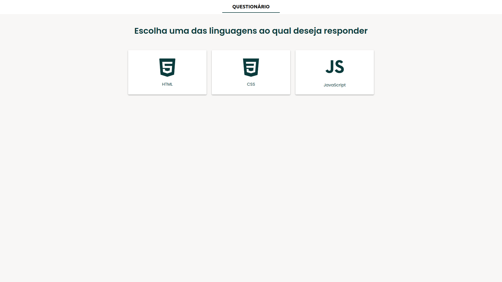
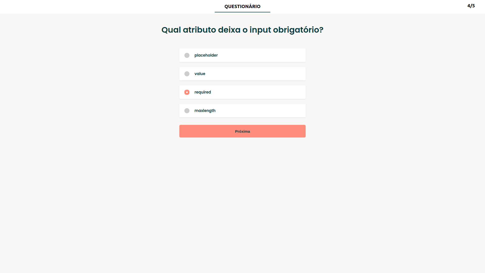
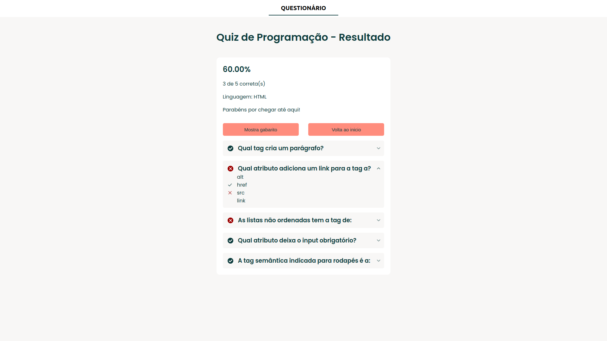

# Quiz de HTML, CSS e JavaScript

Este é um projeto de um quiz interativo focado em testar seus conhecimentos em HTML, CSS e JavaScript. O projeto foi desenvolvido utilizando React, useContext para gerenciamento de estado e eslint para garantir boas práticas de código.

## Demonstração

O projeto está disponível em [https://quiz-henrique.vercel.app/](https://quiz-henrique.vercel.app/).

## Tecnologias Utilizadas

- React
- useContext
- HTML5
- CSS3
- JavaScript
